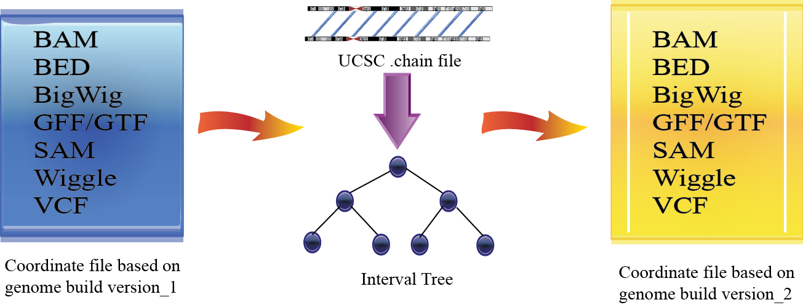

# hg19to38 converter

Simple prepackaged Docker and utility script which uses CrossMap to convert miscellaneous genomic files from the hg19 to hg38.



## Prerequisites

Ensure Docker is installed on your system. You can download it from [Docker's official site](https://www.docker.com/products/docker-desktop).

## Getting Started

### Pulling the Docker Image

First, pull the Docker image from Docker Hub:

```
docker pull gdoy/seglh_crossmap
```

### Using the Docker Container

The provided shell script liftover.sh facilitates the conversion process. This script checks for an input file, defines the input and output directories, and executes the Docker container with the necessary parameters.

```
./liftover.sh yourfile.vcf
```

The script will then process the file and produce an output in the hg38 format with the same directory.